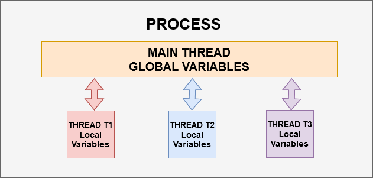

# Python - MultiThreading

**************************************Documentação Base:************************************** 

[https://www.notion.so/josehlp/Python-MultiThreading-80f3ea6476f8442a8d2ec1a77813620d?pvs=4#6bed23ba2a9c4f9a9d9d51c5f628f9fc](https://www.notion.so/Python-MultiThreading-80f3ea6476f8442a8d2ec1a77813620d)



**Exemplo:**

```jsx
import threading
import time

class Tasks:
    def thread_delay(thread_name, delay):
        count = 0
        while count < 3:
            time.sleep(delay)
            count += 1
            print(thread_name, '-------->', time.time())

task = Tasks

t1 = threading.Thread(target=task.thread_delay('thread_1', 0), args=('t1', 1))
t2 = threading.Thread(target=task.thread_delay('thread_2', 0), args=('t2', 1))
t1.start()
t1.join()
t2.start()
print('Threading finish!')
```

- **.start** = Inicia a threading.
- **.join** = Espera a threading ser finalizada para executar os demais códigos abaixo dela.